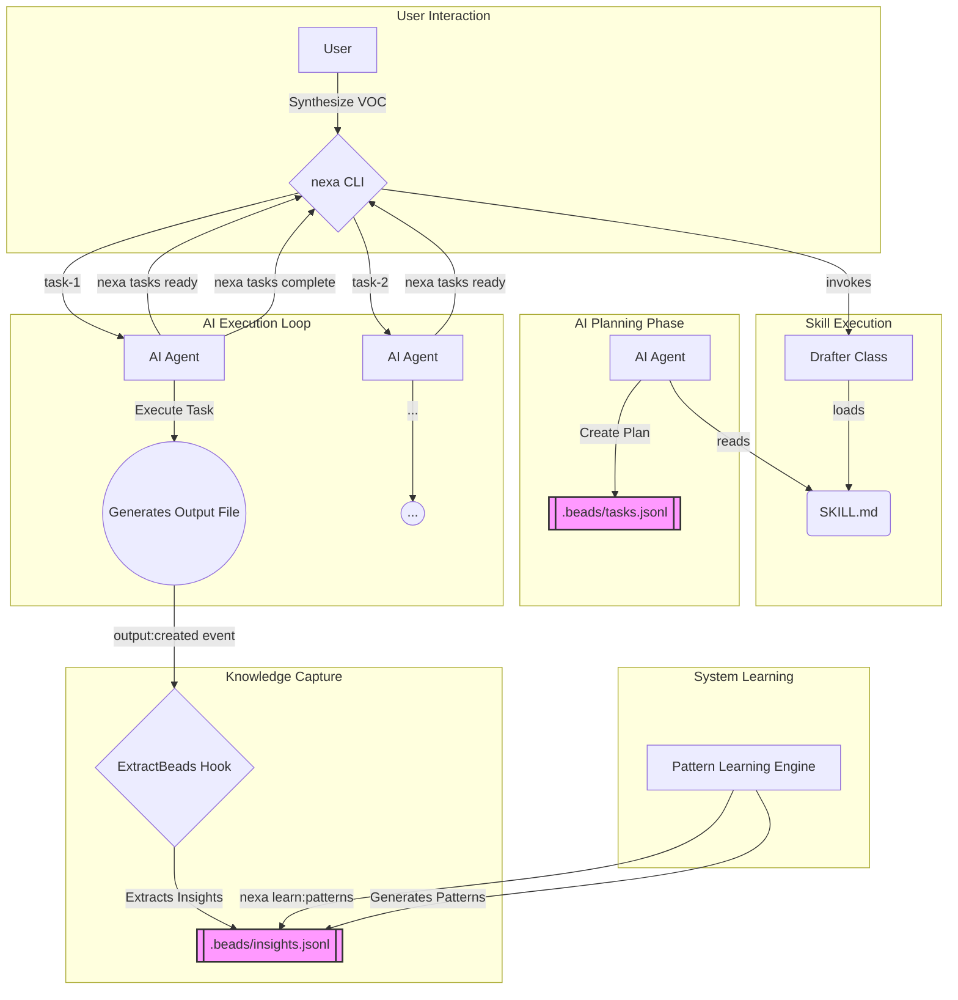

# PM OS v2 Architecture: "The Second Brain"

This document outlines the user and data flow for the "Second Brain" architecture, which combines a "Claude code native" OS with an AI-driven task management layer.

## High-Level Flow Diagram

## Step-by-Step Data Flow

1.  **User Invocation:** The user gives a high-level command to the `nexa` CLI (e.g., `"synthesize voc"`).
2.  **Skill Runner:** The CLI determines the correct flexible skill class to use (e.g., `Drafter`). It instantiates the class and calls its `run` method, passing the path to the relevant `SKILL.md` file.
3.  **AI Planning:** The AI's first action is to read the `SKILL.md`. It interprets the "Core Pattern" section and breaks the skill down into a dependency graph of discrete tasks. It uses the `nexa tasks create` command to populate a new `.beads/tasks.jsonl` file with these `task` beads.
4.  **AI Execution:** The AI enters a loop. In each cycle, it asks the CLI for the next available task (`nexa tasks ready`).
5.  **Task Execution:** The AI executes the specific task (e.g., "Validate source count"). This may involve reading files, running other commands, or generating content. When a task results in a file, an `output:created` event is fired.
6.  **Knowledge Capture:** The `ExtractBeadsFromOutput.hook.ts` listens for the `output:created` event. It runs on the new file, attempting to extract structured knowledge (`insight`, `decision`, `question` beads) and storing them in `.beads/insights.jsonl`. This happens in the background, parallel to the AI's main execution loop.
7.  **Task Completion:** Once the AI completes a task, it informs the CLI (`nexa tasks complete <task-id>`). The CLI updates the state in `tasks.jsonl`, potentially unblocking other dependent tasks.
8.  **System Learning:** Periodically, or when triggered by the user, the `Pattern Learning Engine` (`nexa learn:patterns`) runs. It analyzes all beads in `insights.jsonl` (and potentially `tasks.jsonl`) to discover recurring patterns, which it then stores as new `pattern` beads. This makes the system smarter for the next run.
